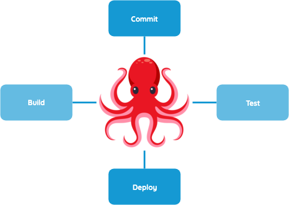
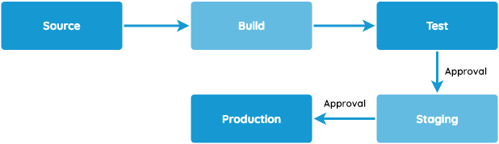
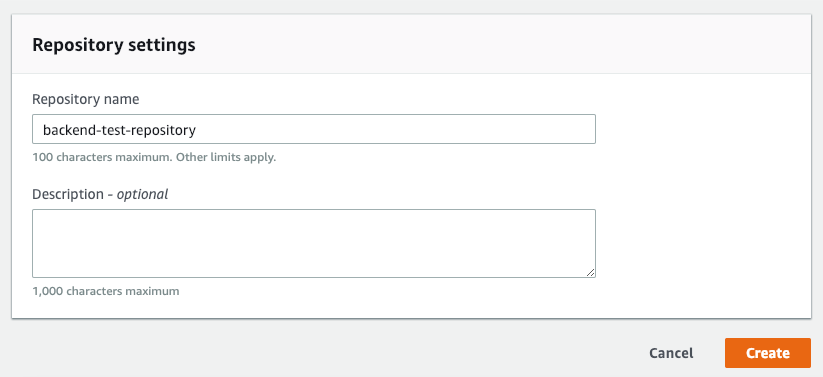
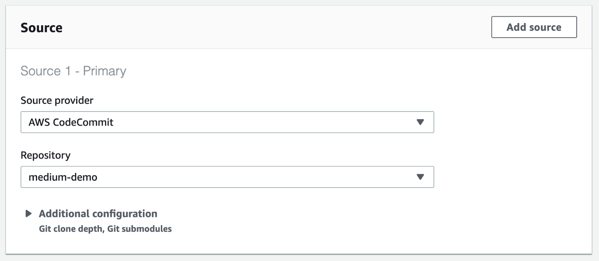
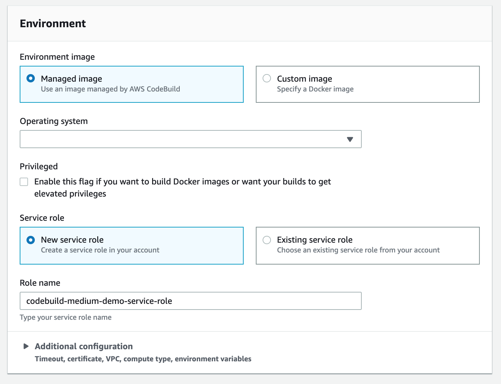
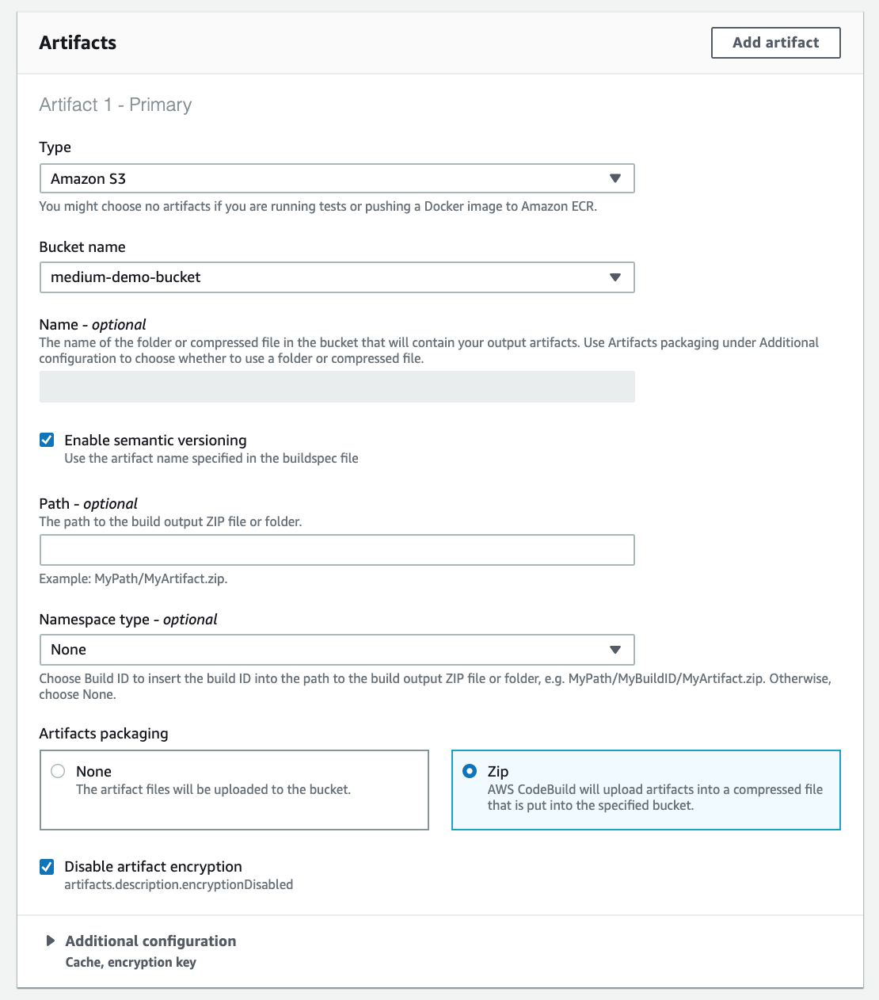
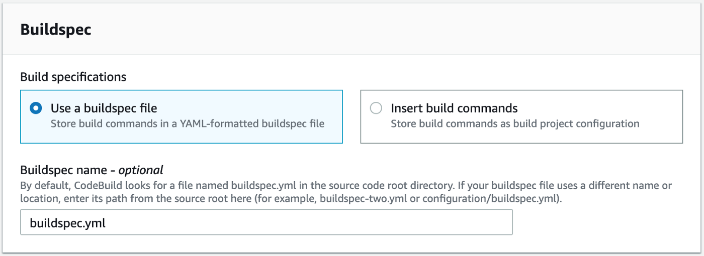
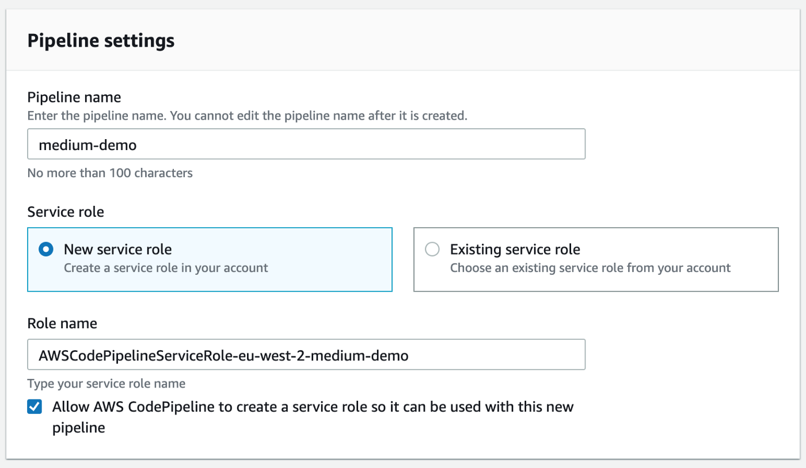
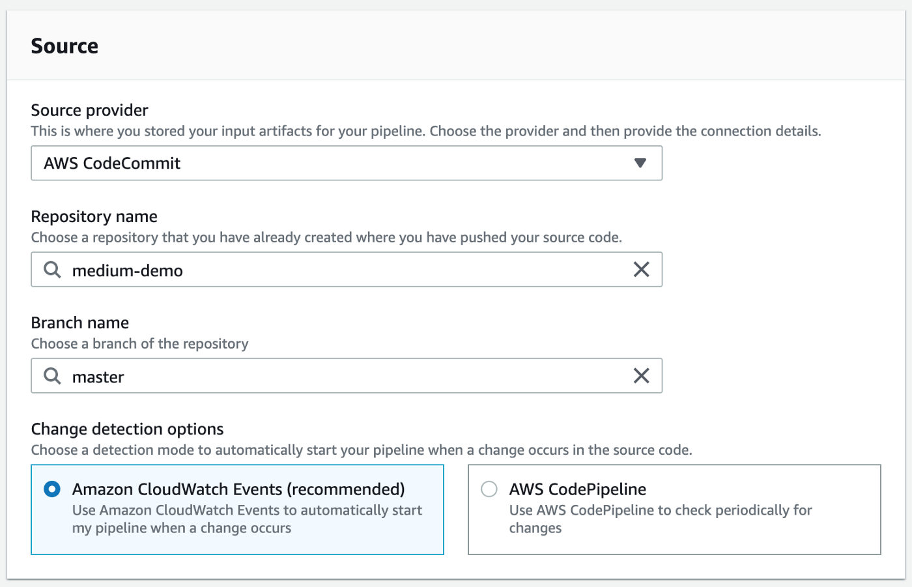
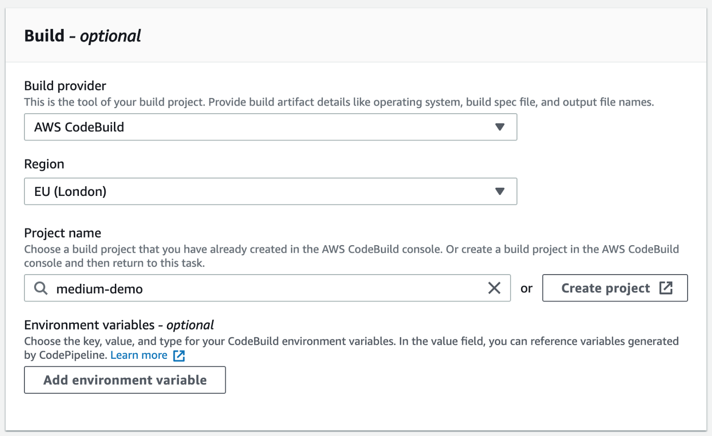

AWS offers a world of cloud services that give us the ability to move our
workflow into a third-party physically managed infrastructure. In this article,
I intend to show how we can adapt and automate the simple use case of continuous
deploying a serverless application, such as a REST API with NodeJS,
**exclusively using AWS services**.



# Introduction

Let’s say you have an application in, for example, NodeJS — you can be using AWS
Lambda and possibly connected to AWS API Gateway. If you haven’t yet automated
this process (externally), you probably look like the octopus above, sharing
your pre-release efforts into each one of the tasks. At certain point, you ask
yourself, how can I bring the most recent release into staging/production rather
than manually building or deploying it?

If we’re talking about Continuous Delivery, CodePipeline is your friend! It
automates building, testing and deployment phases of your process every time
there is a change. In this story, we intend to prepare the pipeline with the
following three stages: Source, Build and Deployment:



- Stage 1 (Source): CodeCommit (or GitHub) for code storage
- Stage 2 (Build): CodeBuild to do the “build” or “bundle” parts, this is as
  simple as zipping up any artifacts you have for NodeJS functions. In the end,
  you will have a file specification, called buildspec.yml, to tell CodeBuild
  what files make up the final build artifact.
- Stage 3 (Deploy): CodeDeploy will call CloudFormation to create or update the
  lambda function with the most recent code. While this process occurs, it will
  be responsible for versioning each release (in case you need to roll back),
  and shift all the traffic to the most recent one. To summarize, CodePipeline
  will glue everything together. It’ll automatically start a build using
  CodeBuild whenever anything is pushed to your CodeCommit/GitHub repository.
  Then when your build is completed and the artifacts are uploaded, it **will
  kick off CloudFormation to update and swap out the application in the
  Lambda**.

## Stage 1: Creating the git repositories using CodeCommit

Since we're using AWS services, we might as well keep everything centralized
here. The first step is to start our git repository which can be done using
Amazon CodeCommit, Amazon S3 or an external source, such as Github. For the
current purpose, we will start one using CodeCommit. If you have more than one
source, both repositories should be created in this stage.



For the purpose, we created a demo NodeJS application which you can copy the
code from.

`gist:plourenco/0a942b23e3e4b7f76c47583b63d8ed0b#app.js`

Just create a new directory with this file inside and setup a new git repository
with the following commands.

```shell script
git init
git remote add origin <clone url>
```

> **Note:** You should be able to find the clone url in the top right corner of
> your repository. After clicking clone HTTPs.

```shell script
git add -A
git commit -m "Initial commit"
git push origin master
```

## Stage 2: Build

The next step is build. We will instruct CodeBuild to package our artifacts into
a compressed file uploaded on an S3 bucket. The next step will pick it up and
deploy. To start,
[create a new build project](https://eu-west-2.console.aws.amazon.com/codesuite/codebuild/project/new).





Before moving on to Artifacts, it is important that you have already created a
**S3 bucket to store the bundles**. If you haven’t, just open a new tab and do
it before proceeding. Afterwards, you should specify its name as below
indicated.





Reaching the Buildspec section, this is where we specify what CodeBuild actually
needs to do to our source files. It is comparable to Jenkinsfile steps or
Gitlab’s `.gitlab-ci.yml` file, if you are familiarized with them.

In our case, we’re defining three stages:

- Installing all NPM dependencies.
- Generating and build or packaging everything into production ready
- An optional extra stage to run your tests

This file **needs to be checked in** the repository, and we’ll instruct
CodeBuild to pick it up by giving its path.

`gist:plourenco/0a942b23e3e4b7f76c47583b63d8ed0b#buildspec.yml`

## Stage 3: Deploy

Having a build stage ready to output our artifact(s), the next stage is to
prepare their deployment. Now here’s the tricky part.

> As of January 2019, CodeDeploy doesn’t support Lambda deployments natively.
> Under those circumstances an Internal Error will arise due to the fact that
> CodePipeline only supports ZIP/TAR/TGZ as the bundle type, and CodeDeploy
> requires the bundle to be YAML or JSON for a Lambda deployment.
>
> This problem was
> [reported on the AWS forums](https://forums.aws.amazon.com/thread.jspa?messageID=864336).

The next step can save you hours of trouble. As an alternative, we will use
CloudFormation (through AWS Serverless Application Model — SAM) to deploy the
application. SAM is a CloudFormation extension that allows the definition of
serverless applications in a simple and clean syntax. Essentially, it can be
seen as an abstraction of existing CloudFormation resources.

### 3.1 CloudFormation Template Definition

Back to the stage logic; in sum, our template requirements include the
definition of a resource that receives a build bundle as input and creates a new
lambda function with it. The ideal use case for this function would be:

1. Detects when new code is being deployed, based on changes to the Lambda
   function’s Amazon S3 URI. Deploys new versions of your Lambda function, and
   automatically creates aliases that point to the new version.
2. Gradually shifts customer traffic to the new version until you’re satisfied
   that it’s working as expected, or you roll back the update.

The template declares three resources:

- Lambda function: The main resource that will be responsible for invoking your
  application server whenever there’s a new request.
- API Gateway: The API Gateway will be responsible for exposing your lambda
  function as RESTful API to the Internet (a bridge).
- Invoke permission: This resource is required to guarantee the gateway can
  actually invoke and pass the requests to the lambda.

The
[following SAM template](https://gist.github.com/plourenco/0a942b23e3e4b7f76c47583b63d8ed0b#file-template-yml)
defines this type of resource. To achieve the first item, we declared
**AutoPublishAlias** as **true**, which handles the new version generation
associated with a specific alias. For the second, you may choose the
[type of deployment preference that most suits your use case](https://docs.aws.amazon.com/serverless-application-model/latest/developerguide/automating-updates-to-serverless-apps.html).
In the following example, we are shifting traffic **AllAtOnce**.

Guess what? This file also **needs to be checked in**.

## 3.2 Closing the Pipeline

Finally, after creating each stage individually, we have all the dependencies
required to start creating a new pipeline.







---

The last step, Deployment, will divide into two actions. Since the “getting
started” dialog is a bit limited, let’s skip it and generate the pipeline as-is.
Afterwards, you can edit the recently created pipeline and add a new stage. The
first action group will contain an action for **Creating and replacing a change
set**.


> **Note:** Parameter overrides field should be a single line JSON without any
> spaces. It specifies the bucket location where the built artifact from the
> previous stage is.

One of the fields will ask you for a role name. This role is what indicates
which permissions are given for CloudFormation to summon and create a new change
set to deploy your function. You will have to create a new role with the
following properties:

- Trusted entity — AWS CloudFormation
- Permissions — AWSLambdaExecute
- Role name — `cfn-lambda-pipeline`

After creating, you should add a new inline policy with the following JSON:

`gist:plourenco/0a942b23e3e4b7f76c47583b63d8ed0b#cfn-lambda-role.json`

Moving on to the second action group, it should be an action to Execute a
changeset:


## Closing Remarks

CodePipeline is complex to setup. It took us a few weeks and AWS support calls
to actually reach a stage where we weren’t updating it anymore. Before using
such service, we were confident that keeping our development operations in an
AWS managed fashion would ease our life.

After about 6 months, when I’m finishing this story, we’re no longer using
CodePipeline. But, surprisingly, the reason we transitioned wasn’t because it
was different or complex, it was because we needed to do cross-account
deployments into different regions. AWS allows you to do deployments to a
different account using this service, but, **in the same region**.
Consequently, this was the time we realized that external operations would do
deployments anywhere without any limitation.

We hope that this story serves as a guide for future companies or individuals
considering to have their operations AWS-based. In my personal opinion, I would
recommend it mainly for small to medium projects. However, if you’re in to try
it out, there’s only one way to find out, and that will probably include going
back to the top of the story!

Thank you for reading.
